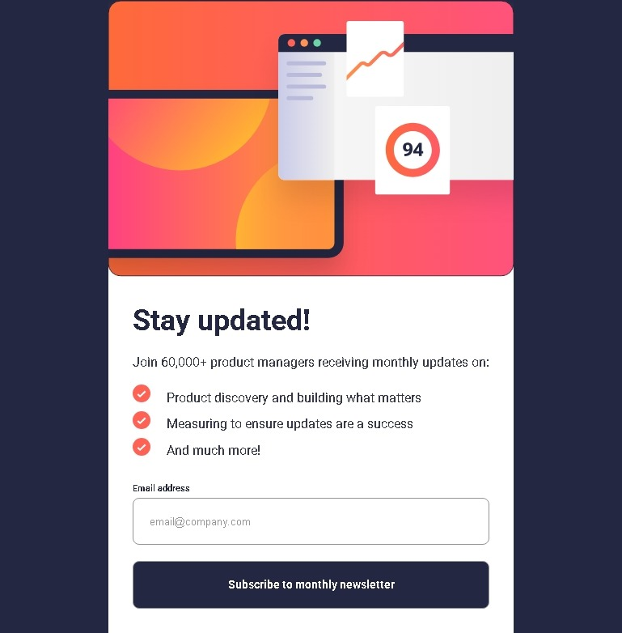
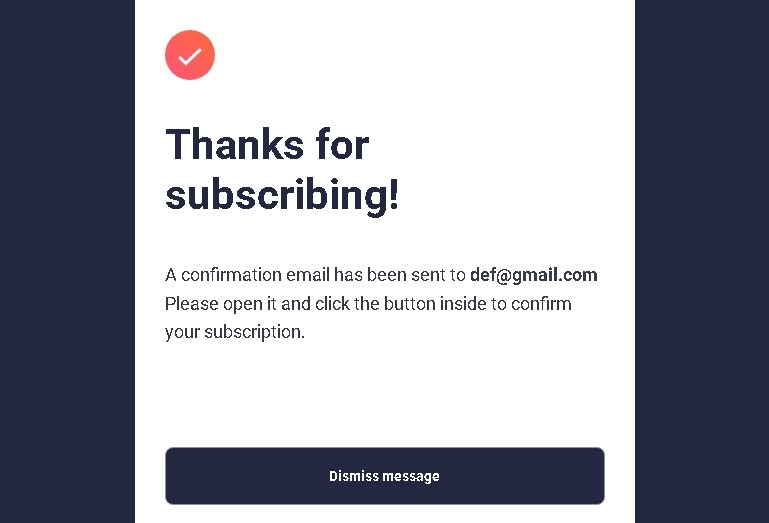
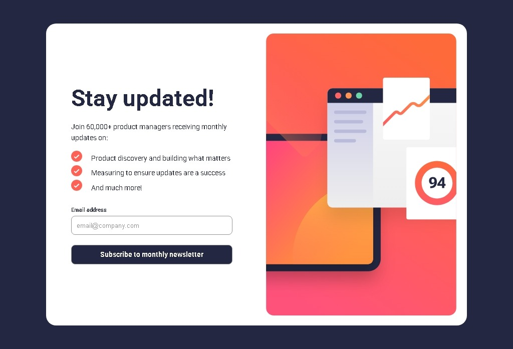
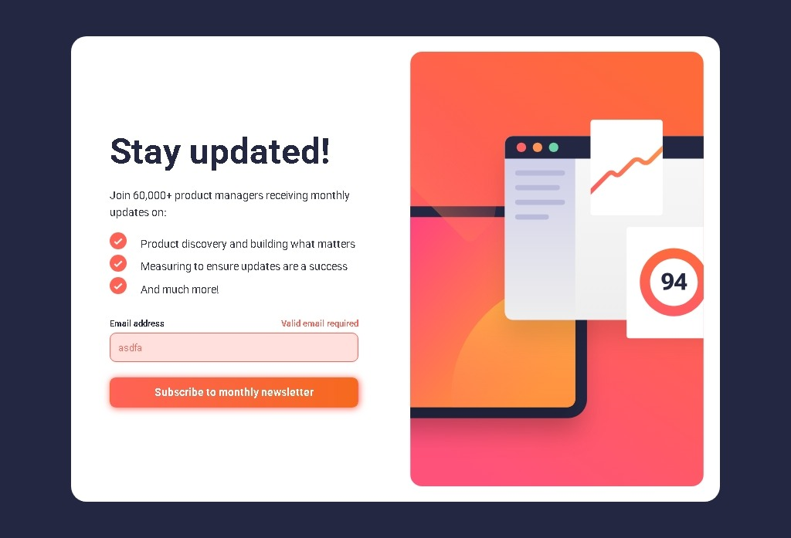
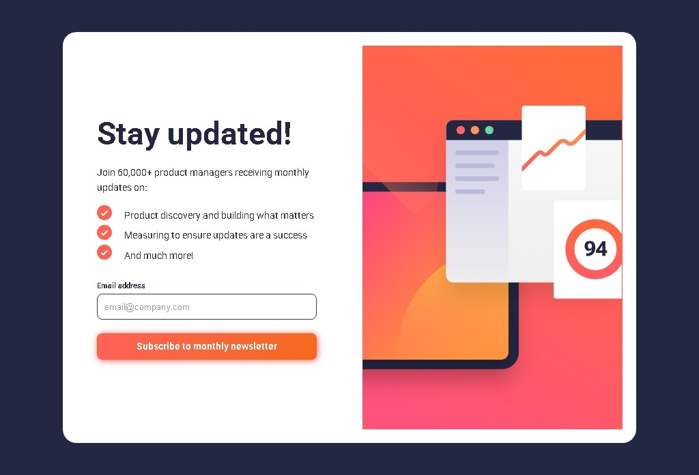

# Frontend Mentor - Newsletter sign-up form with success message

This is a solution to the [newsletter-sign-up form with success message on Frontend Mentor](https://github.com/gillaercio/newsletter-sign-up-with-success-message-main). Frontend Mentor challenges help you improve your coding skills by building realistic projects

## Table of contents

- [Overview](#overview)
  - [Screenshot](#screenshot)
  - [Links](#links)
- [My process](#my-process)
  - [Built with](#built-with)
  - [What I learned](#what-i-learned)
  - [Continued development](#continued-development)
- [Author](#author)

## Overview

### Screenshot

These are my screenshots showing how the project turned out.

- Mobile design:


- Mobile success:


- Tablet design:



- Tablet success:



- Desktop design:



- Desktop success:


- Desktop success active:


- Erros states:



- Active states:



### Links

- Solution URL: [My Solution](https://github.com/gillaercio/newsletter-sign-up-with-success-message-main)

## My process

### Built with

- Semantic HTML5 markup
- CSS custom properties
- Flexbox
- CSS Grid
- Mobile-first workflow
- JavaScript

### What I learned

I took advantage of this project to practice using **BEM** with HTML, **Reset CSS**, **Pseudo-elements** and  **Variables** with **CSS** and **DOM** and **Regex** with **JavaScript**:

BEM (Block Element Modifier)

```html
<section class="newsletter__success is-hidden">
  <div class="newsletter__success-container">
    <div class="newsletter__success-image"></div>
    
    <h2 class="newsletter__success-title">Thanks for subscribing!</h2>
    <p class="newsletter__description">
      A confirmation email has been sent to <span>ash@loremcompany.com.</span>
      Please open it and click the button inside to confirm your subscription.
    </p>
  </div>

  <button type="button" id="dismiss-button">
    Dismiss message
  </button>
</section>
```

Reset CSS

```css
*,
*::before,
*::after {
  margin: 0;
  padding: 0;
  box-sizing: border-box;
}
```

Pseudo-elements

```css
.newsletter__benefits li::before {
  content: '';
  position: absolute;
  left: 0;
  top: 30%;
  transform: translateY(-50%);
  width: 22px;
  height: 22px;
  background-image: url('../images/icon-list.svg');
  background-size: contain;
  background-repeat: repeat;
}
```

Variables

```css
:root {
  --Red: hsl(4, 100%, 67%);
  --Red-button: hsla(4, 100%, 67%, 0.200);
  --Orange: hsl(21, 92%, 54%);
  --Blue-800: hsl(234, 29%, 20%);
  --Blue-700: hsl(235, 18%, 26%);
  --Grey: hsl(0, 0%,58%);
  --White: hsl(0, 0%, 100%);

  --roboto: 'Roboto', sans-serif;

  --text-sm: 700 1.1rem/120% var(--roboto);
  --text: 1.6rem/160% var(--roboto);
  --text-button: 700 1.4rem/120% var(--roboto);
  --text-feature: 700 3.6rem/120% var(--roboto);
}
```

DOM

```js
const form = document.querySelector(".newsletter__form");
const dismissButton = document.getElementById("dismiss-button");

form.addEventListener("submit", sendButton);
dismissButton.addEventListener("click", resetForm);
```

REGEX

```js
const emailRegex = /^[^\s@]+@[^\s@]+\.[^\s@]+$/;
// ...
  if (!emailValue) {
    error = "This field is required";
  }
  else if (!emailRegex.test(emailValue)) {
    error = "Valid email required";
  }
// ...
```

### Continued development

I would like to improve the use of the **HTML**, **CSS** and **JavaScript**.

## Author

- Frontend Mentor - [@gillaercio](https://www.frontendmentor.io/profile/gillaercio)
- Github - [My Github](https://github.com/gillaercio)
- LinkedIn - [My LinkedIn](https://www.linkedin.com/in/gildman-la%C3%A9rcio/)